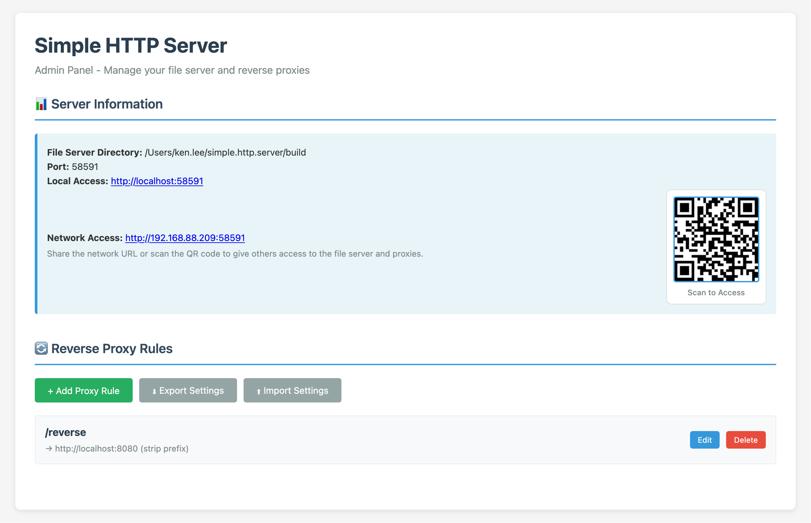
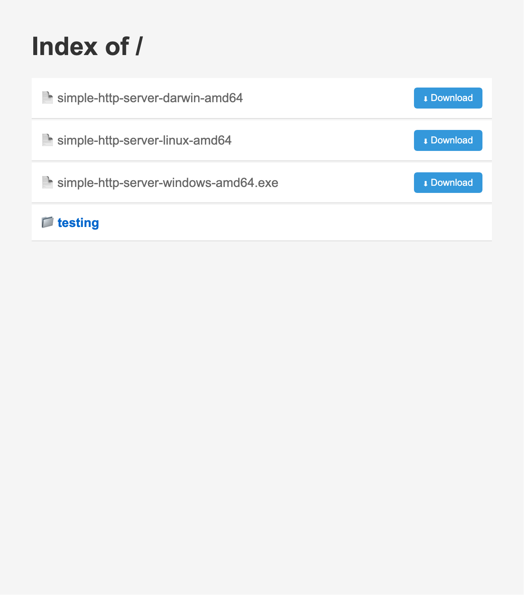

# Simple HTTP Server

A lightweight file server with reverse proxy support and live reload capabilities.

Download here: [Releases](https://github.com/Ryuuu825/simple-http-server/releases)




## Features

- Static file server with automatic live reload
- Reverse proxy support (path-based and port-based)
- Web-based admin panel with configuration interface
- Automatic local IP detection for network sharing
- QR code generation for easy mobile access
- File download support for all file types
- Recursive subdirectory monitoring
- Automatic port assignment to avoid conflicts
- Cross-platform support (Windows, macOS, Linux)

## Installation

### Download Pre-built Binaries

Download the appropriate binary for your platform:

- Check the [Releases](https://github.com/Ryuuu825/simple-http-server/releases) page for the latest version.

## Usage

### macOS / Linux

```bash
# Make the binary executable
chmod +x simple-http-server-*

# Run the server
./simple-http-server-darwin-arm64
```

### Windows

Double-click the executable or run from command prompt:

```cmd
simple-http-server-windows-amd64.exe
```

### What Happens

1. The server starts on a random available port
2. The admin panel opens automatically in your default browser
3. The server displays the local and network URLs
4. A QR code is generated for easy mobile access

## Configuration

### Admin Panel

Access the admin panel at `http://localhost:[PORT]/admin/` to:

- View server information and network URLs
- Configure reverse proxy rules
- Export/import server settings
- Monitor connected clients

### Reverse Proxy

The server supports two types of reverse proxy configurations:

#### Path-Based Proxy

Proxy requests based on URL path prefix:

```json
{
  "path_prefix": "/api",
  "target_url": "http://localhost:3000",
  "strip_prefix": true
}
```

Example: `http://localhost:8080/api/users` proxies to `http://localhost:3000/users`

#### Port-Based Proxy

Proxy all requests on a specific port to a target:

```json
{
  "port": 8081,
  "target_url": "http://localhost:3000"
}
```

Example: All requests to `http://localhost:8081/*` proxy to `http://localhost:3000/*`

## File Server

### Directory Listing

Navigate to any directory to see a clean file listing with:
- Clickable files and folders
- Download button for each file
- Parent directory navigation

### Live Reload

The file server automatically monitors file changes and refreshes the browser when:
- Files are created, modified, or deleted
- Subdirectories are added or changed

### Download Files

Click the "Download" button next to any file to force download instead of viewing in the browser.

## Network Sharing

Share your file server with others on the local network:

1. Check the "Network Access" URL in the admin panel
2. Share the URL or have others scan the QR code
3. Others can access your files and configured proxies

## Settings

### Export Settings

Export your proxy rules and configuration:

```bash
# From the admin panel, click "Export Settings"
# Downloads a JSON file with all configurations
```

### Import Settings

Import previously saved configurations:

```bash
# From the admin panel, click "Import Settings"
# Select your JSON configuration file
```

## Command Line Options

Currently, the server uses automatic configuration:
- Port: Automatically assigned by the OS
- Directory: Current working directory (or executable directory on macOS)

## Troubleshooting

### macOS Security Warning

On first run, macOS may block the executable:
1. Go to System Preferences > Security & Privacy
2. Click "Allow Anyway" for the blocked application
3. Run the executable again

### Permission Denied (Linux/macOS)

Make the file executable:
```bash
chmod +x simple-http-server-*
```

### Port Already in Use

The server automatically selects an available port, so this should not occur. If it does, check for other proxy rules using the same port.

### Browser Doesn't Open

The server will still run even if the browser fails to open. Manually navigate to the URL shown in the terminal output.

## License

MIT License

## Contributing

Contributions are welcome! Please feel free to submit a Pull Request.
